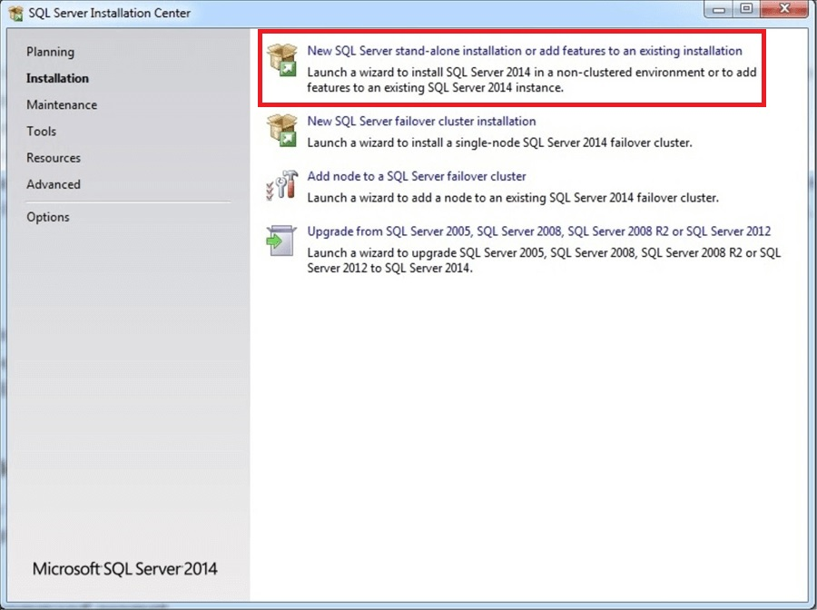
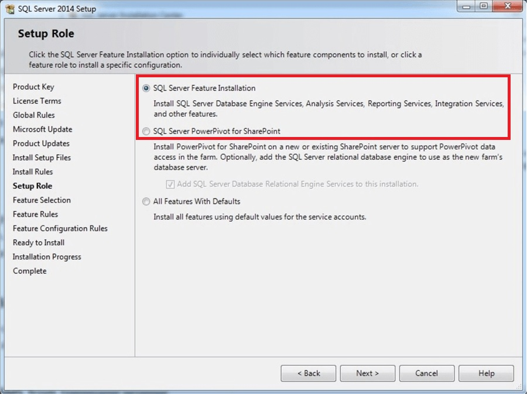
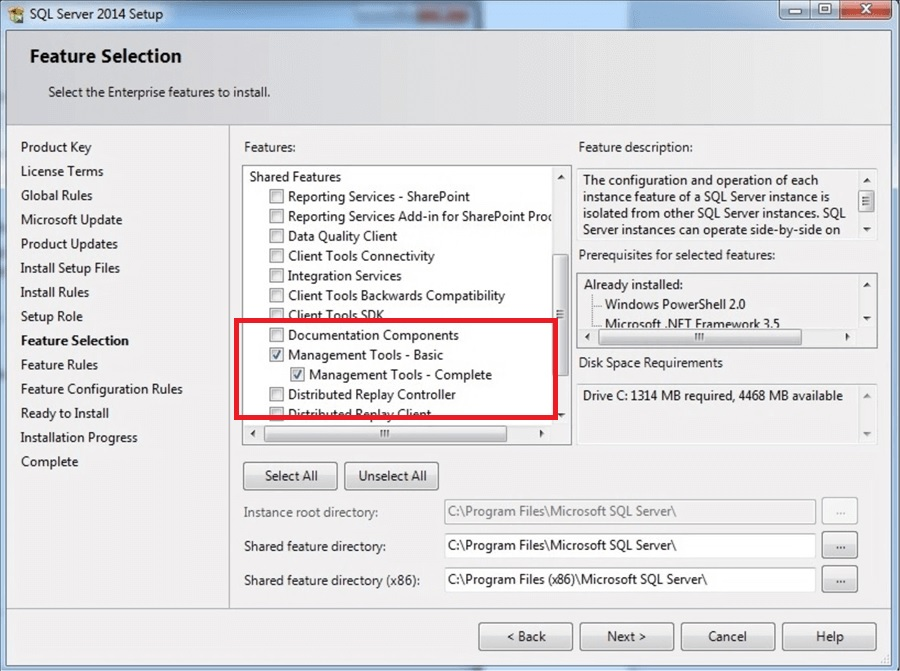
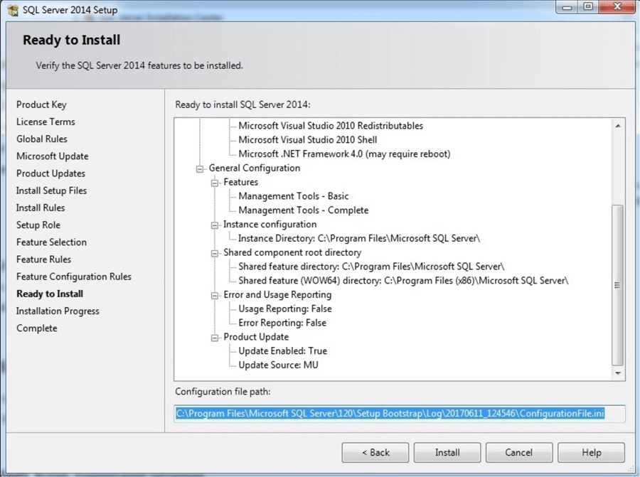
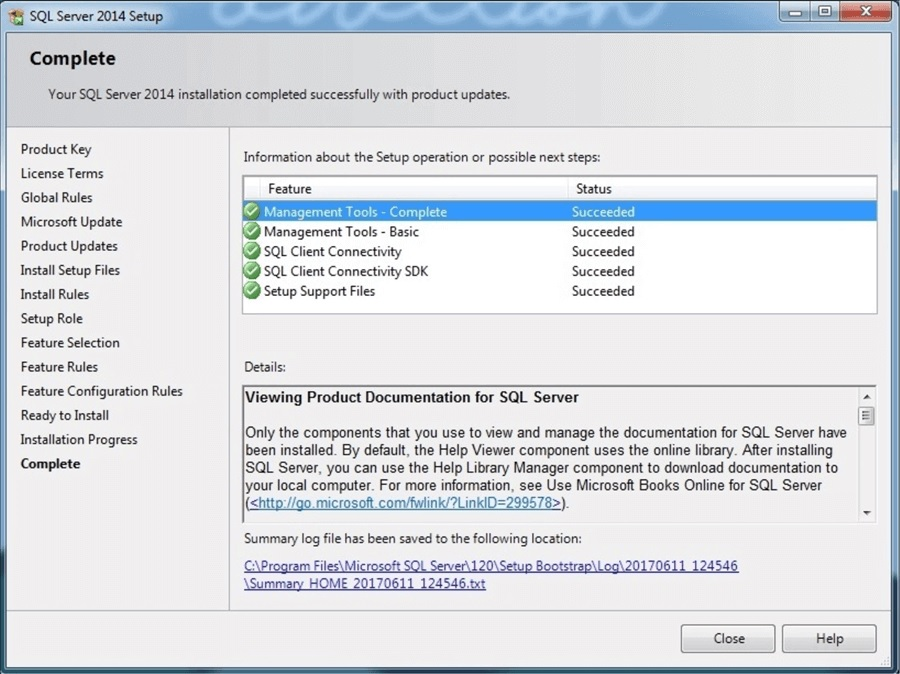

# Instalación de SQL Server Management Studio

En varios de los videos que has visto de seguro has podido ver que usamos SQL Management Studio. Bueno, se trata de la mejor aplicación de administración de SQL que puedes encontrar, ya sea Server o Azure. La aplicación es gratuita y no se trata de una instalación de SQL Server como muchos piensan, solo es el gestor. Como puedes ver en el artículo de este mismo repositorio también puedes hacerlo con [Visual Studio Code](https://www.visualstudio.com/es/) o [Visual Studio](https://www.visualstudio.com/es/). La única razón por la que podrías usar SQL Management Studio es tener más posibilidades de administración a tu alcance.

Comencemos a ver cómo lograr tener SQL en tu equipo.

1.- Descarga el paquete de SQL Management Studio desde [aqui](https://docs.microsoft.com/en-us/sql/ssms/download-sql-server-management-studio-ssms).

2.- Ya descargado inicia la instalación, después de unos segundos de que el archivo se haya descomprimido podrás ver la pantalla inicial en donde podrás seleccionar la primera opción como se muestra en la imagen.

3.- En la segunda pantalla seelecciona la opción **SQL Feature Installation**.

4.- En esta nueva pantalla puedes seleccionar todas las características que necesites pero solo requieres la señalada para instalar lo que por ahora nos interesa.

5.- Después de presionar el botón de **Siguiente** te aparecerá un opción de revisión final con los datos para que seas feliz y confirmes que todo está en orden.

6.- En la pantalla final se realizará una validación de todos los elementos requeridos por SQL, no deberías tener ningún problema aquí. 

Después de unos minutos dependiendo de tu equipo, tendrás ya listo SQL Server Management Studio. ¡A jugar!

No olvides levantar un Issue si encuentras algo que te detenga.