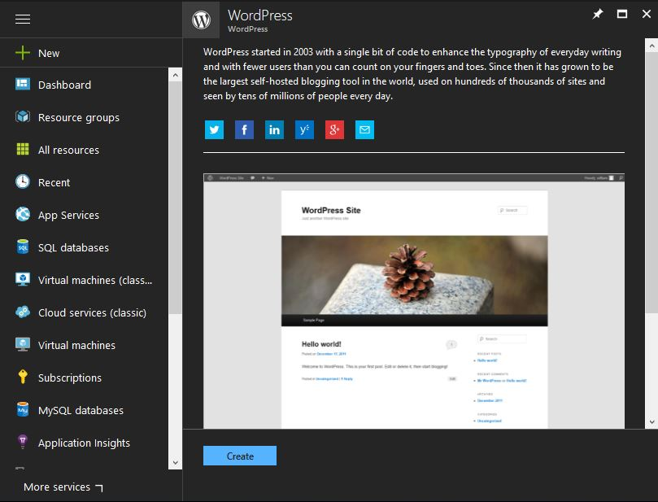
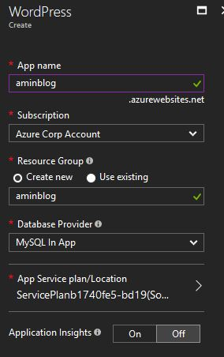
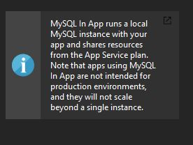
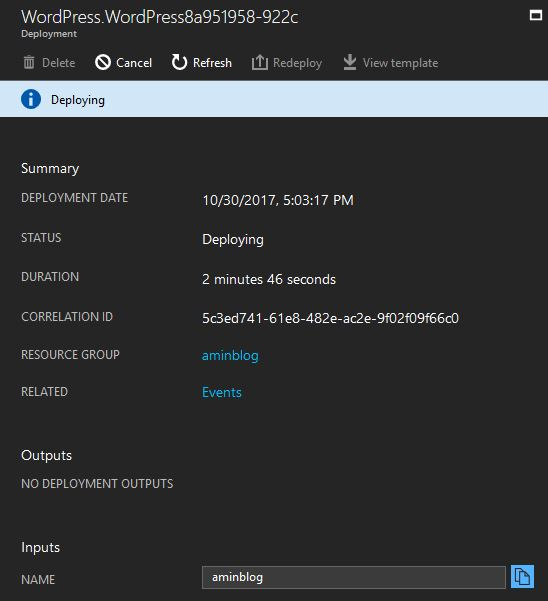
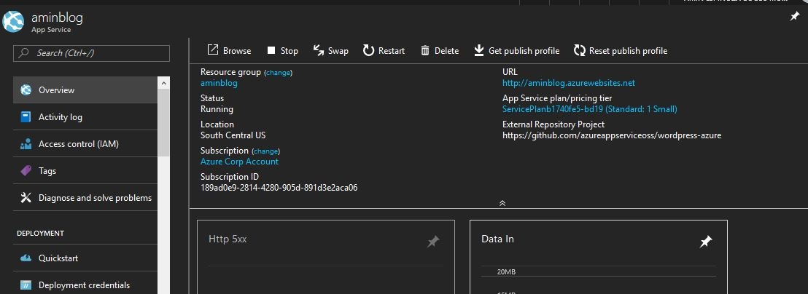
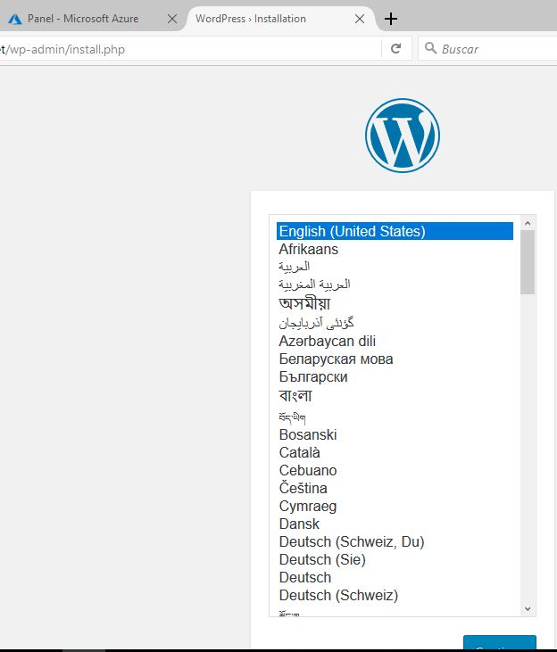
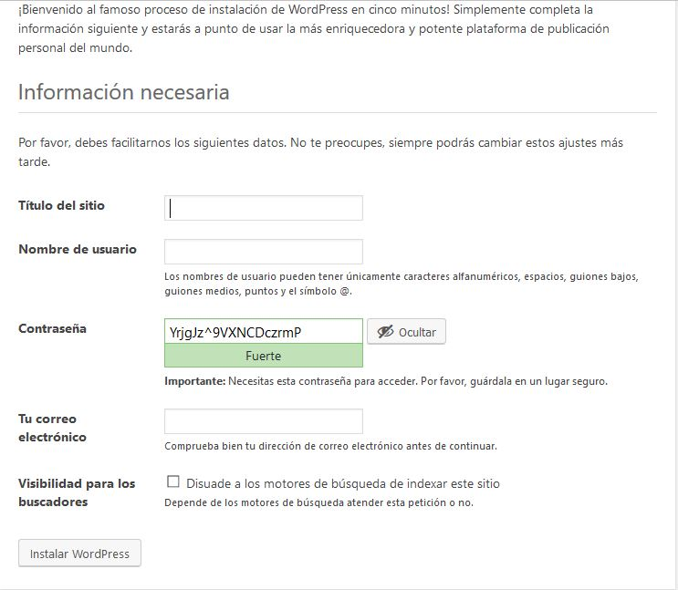
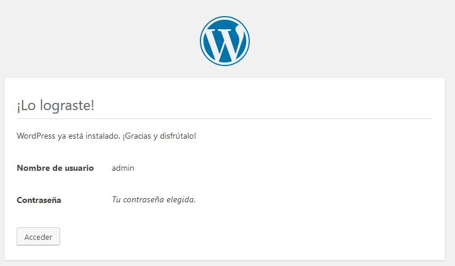
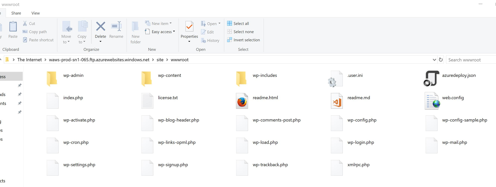

# Instalando Wordpress en Azure Web Site

Hemos visto con emoción como aprovechar las grandes ventajas de usar una plataforma tan cómoda como los Web Sites de Azure y aunque hasta ahora ha resultado sumamente fácil lo podremos hacer mucho mejor apoyándonos en la [tienda de aplicaciones de Azure](https://azuremarketplace.microsoft.com/en-us).

### Instalando Wordpress en Azure Web Sites

Entra a tu portal y busca el término de Wordpress. Aparecerán muchas opciones, la primera, naturalmente es la que debes escoger.

En la sección de creación podrás escoger parámetros como los que se muestran a continuación, como proveedor de bases de datos no importará el motor que uses, no advertirás ninguna diferencia en el producto final.

Con el proveedor de bases de datos elegido en esta ocasión se trata explícitamente de una base de datos NO recomendada para fines productivos pero ¡A quién le importa! Solo nos estamos divirtiendo por ahora así que está bien.

Espera un poco, en esta parte del proceso solo basta esperar.

Una vez creado, tendrás ya acceso a tu sitio web.

Selecciona la URL de tu sitio y verás en una nueva pestaña que Wordpress está listo para que lo puedas configurar.

Configura los parámetros requeridos, te recomendaría usar la contraseña establecida ahí y una vez terminadas, ya quedarás listo. 

Con todo terminado tendrás una pantalla como la siguiente.

Entra por FTP y podrás notar que ya todos los archivos característicos de Wordpress están listos, que todo está ya configurado y que tú solo debiste dar unos cuantos clics.

Esta es la definición perfecta de una implementación tipo IaaS (Infrastructure as a Service) en donde no solo no te preocupaste por crear el sitio web sino que tampoco debiste considerar las implicaciones técnicas de la instalación de Wordpress. 

Busca más opciones en la tienda de aplicaciones de Azure, de seguro encontrarás opciones que en algún momento te podrán evitar horas de esfuerzo haciendo algo que ya está hecho.
