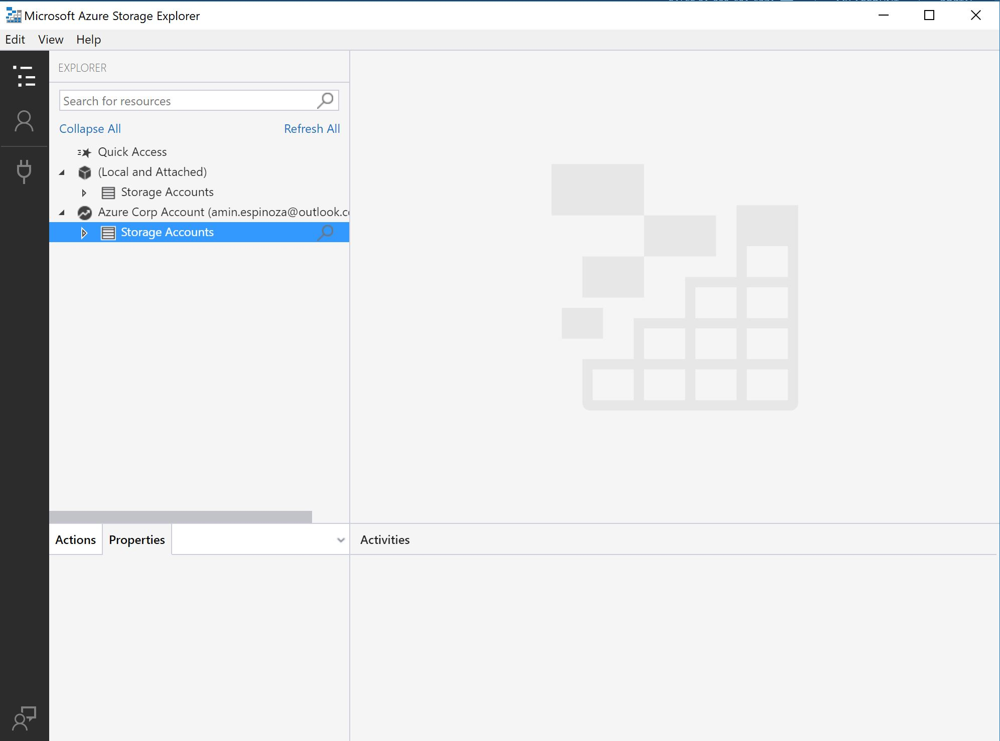

# Azure Storage Explorer

Este tema corresponde al tema número 7: **Azure Storage Explorer**

Puedes ver el video en este [enlace](https://platzi.com/clases/azure/).

### Storage Explorer

Una gran herramienta para trabajar con los servicios de almacenamiento de Azure es el [Azure Storage Explorer](https://azure.microsoft.com/en-us/features/storage-explorer/). Se trata de una muy útil herramienta para trabajar con cualquier tipo de almacenamiento dentro de la nube de Microsoft.

Puedes descargarlo directamente desde [aquí](https://go.microsoft.com/fwlink/?LinkId=708343&clcid=0x409) y con cualquier sistema operativo podrás usarlo. Una vez instalado, va a lucir de la siguiente manera.

Ya con esto, podrás comenzar a trabajar sin problemas.

No olvides levantar un Issue si encuentras algo que te detenga. 

¡Disfruta!
