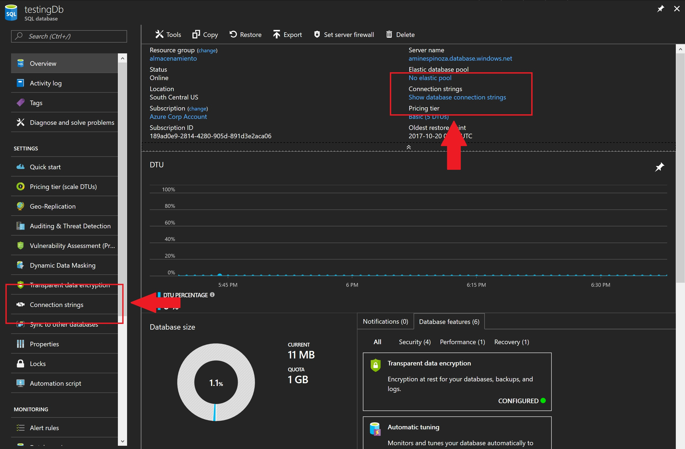
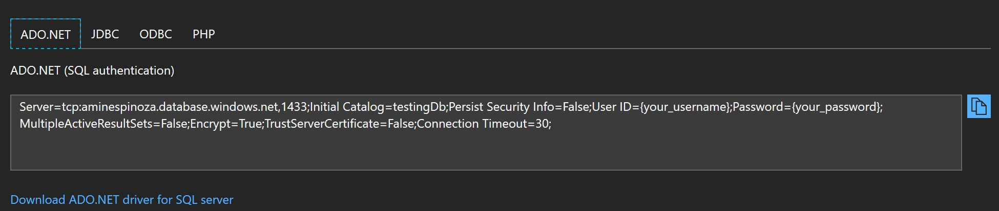
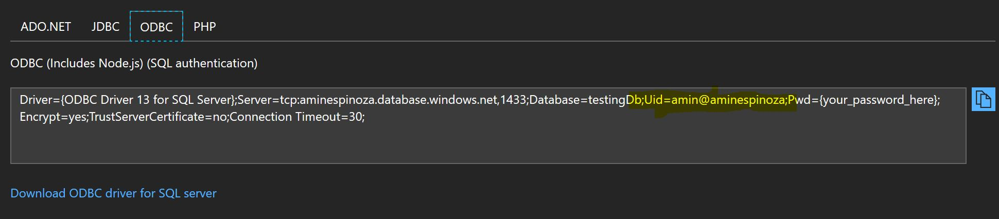

# SQL Server desde Visual Studio Code

Este tema corresponde al tema número 33: **Conectándome a mi base de datos de SQL desde Visual Studio Code**

Puedes ver el video en este [enlace](https://platzi.com/clases/azure/).

### Obteniendo mi cadena de conexión

En el video 33 vimos como conectarnos a SQL Azure desde Visual Studio Code y la verdad es que para operaciones sencillas se trata de una manera muy útil y veloz de hacerlo, pudiste ver que al establecer una conexión por primera vez te pedirá un montón de datos, bueno, aquí haré un poco de trampa y aprenderás a hacerlo de manera veloz.

Entra a tu portal de Azure, ve a la sección principal de tu base de datos, selecciona una de las dos opciones marcadas a continuación.

Te aparecerán varias opciones basándose en la tecnología.

Hay algo curioso, en ADO.NET no te es posible conocer el nombre de usuario en la cadena de conexión, esto refleja un buen nivel de seguridad pero todo acaba cuando simplemente vas a otra tecnología..

Copia todo este texto y después agrega únicamente el password que hayas establecido. Una vez teniendo listo podrás insertar toda la cadena de conexión en Visual Studio Code y con eso podrás omitir cualquier margen de error al ingresar la información y lo mejor !solo en un paso!

No olvides levantar un Issue si encuentras algo que te detenga. 

¡Disfruta!
Repositorio donde se encuentra todo el material del curso de PaaS en Platzi.

