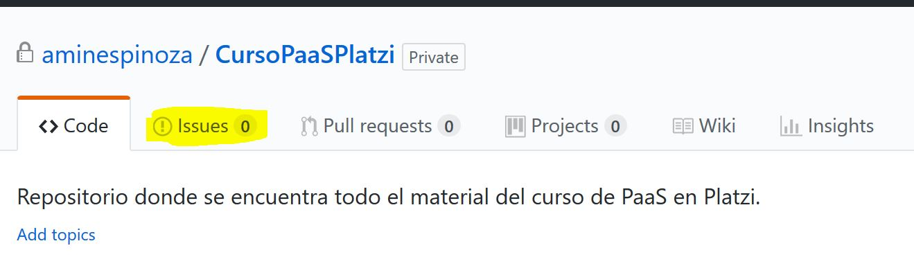

# CursoPaaSPlatzi

!Hola!

Muchas gracias por visitar este repositorio. Esto indica que estás tomando la carrera de Azure Platform as a Service en Platzi. Aquí tienes todos los documentos que sirven de complemento para poder obtener lo mejor de tu carrera.

Seguramente algo se me puede escapar, pude haber omitido algún documento y si es así corre a la sección de Issues y avísame, te lo agradeceré mucho y seguramente toda la comunidad Platzi también.

Por el contrario si crees que hay material adicional que debe estar aquí o tu mismo quieres contribuir con algo a esto solo dímelo y te agrego como colaborador para que seas tú mismo quien suba lo que crees que puede servir para los demás. ¡Solo entre todos podremos crear un gran curso de referencia para los demás!

## Para contribuir por medio de Issues

Si encuentras desde un error en la escritura hasta un archivo omitido en la carrera de Platzi solo levanta un Issue.

Cada viernes (por máximo, si es posible lo haré antes) revisaré los datos de esta sección y podré corregir todo lo que encuentres y publiques. Cada contribución y nuevo archivo tendrá el crédito correspondiente de quien haya levantado un Issue.

## Para solicitar acceso como contribuidor

Levanta un Issue especificando que tipo de contenido quieres subir o cuál quieres modificar, nos buscaremos y pondremos de acuerdo desde un medio privado y después de pasarme tus datos quedaremos listos para comenzar a trabajar en conjunto.

## Guía de materiales

Aquí tienes la guía de donde encontrar los materiales complementarios de la carrera ¡Disfruta y aprende mucho!

| Tema | Descripción y enlace |
| --------- | -------------------- |
| 7. Azure Storage Explorer | [Instalación link de descarga y tutorial](https://github.com/aminespinoza/) |
| 9. SDK de Blob Storage | [Ejercicios complemento del SDK de Blob Storage](https://github.com/aminespinoza/) |
| 13. SDK de File Storage | [Ejercicios complemento del SDK de File Storage](https://github.com/aminespinoza/) |
| 15. SDK de Table Storage | [Ejercicios complemento del SDK de Table Storage](https://github.com/aminespinoza/) |
| 22. SDK de Queue Storage | [Ejercicios complemento del SDK de Queue Storage](https://github.com/aminespinoza/) |
| 26. API REST Storage Services | [Ejercicios complemento del API Rest de Storage Services](https://github.com/aminespinoza/) |
| 33. SQL Azure desde VS Code | [Complemento de SQL Azure y su conexión desde VS Code](https://github.com/aminespinoza/) |
| 40. SQL Datawarehouse | [Scripts complemento de los videos de SQL Datawarehouse](https://github.com/aminespinoza/) |
| 47. Creación de PostgreSQL desde terminal | [Scripts para crear una DB desde terminal](https://github.com/aminespinoza/) |
| 51. Cliente .NET para CosmosDB | [Como consumir datos desde CosmosDB vía .NET](https://github.com/aminespinoza/) |
| 68. Crear mi API con ASP.NET | [Como hacer consultas SQL desde esta API](https://github.com/aminespinoza/) |
| 82. Fusionando Mobile Apps con Notification Hubs | [Todo lo que necesitas para lograr terminar este video](https://github.com/aminespinoza/) |
| Documentos adicionales | [Varios documentos para complementar este curso de PaaS](https://github.com/aminespinoza/) |